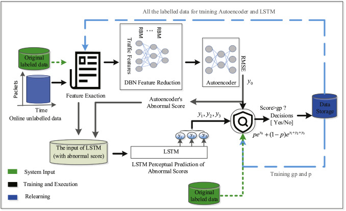

# What is CPIP?

​	CPIP is an **online**, **unsupervised** network anomaly detection system which can effectively cope with various of network intrusion activities, including some zero-day attacks.



​	As the above figure shows, first in the feature extraction stage, CPIP use *AfterImage* to extract feature from the meta-data of the packets (which is irrelavant to the payload of the packets and adapts well to the encrypted traffic). The feature contain over 100 statistics of the traffic flow including volume, packet rate, jitter and etc. Then in the anomaly detection stage, CPIP use DBN-AE to perform **single point** anomaly detection on the arriving packet, and use LSTM to detect **time series** anomalies. By combining both of them, CPIP can more precisely detect the intrusion activities.


# Usage

## Implementation details

This program is implemented with `Python 3.6`, and all the requirements are listed in `requirements.txt`


## Running the demo example

- Installing the requirements:

  ```
  pip install -r requirements.txt
  ```

- Running the demo script:

  ```
  python demo.py
  ```

- After running the program, the result will be show in the following figure:

  

- This figure shows how the anomaly score of the samples varies before and after the DDoS attack, it can be seen that the anomaly scores increase dramatically after the DDoS happens.


# Citations

This repo is part of our work:

***HELAD: A novel network anomaly detection model based on heterogeneous ensemble learning***

If you use the source code, please cite our paper.
